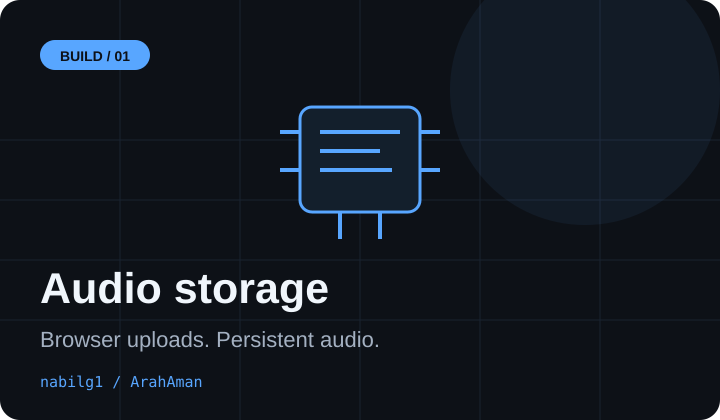
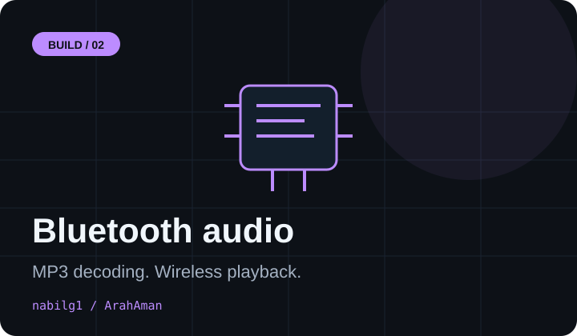
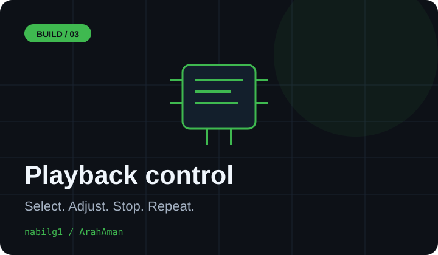

# Nabil Gusfermanto

<p align="center">
  
</p>

<p align="center"><sub><em>
I learn by turning ideas into working systems.<br />
From firmware on an ESP32 to a web interface in the browser, I enjoy connecting the pieces and understanding how they work together.<br />
Build one component. Test it on the device. Keep what works, then improve the next part.
</em></sub></p>

**[Explore my work →](https://github.com/nabilg1?tab=repositories)**

---

## Now

**Building ArahAman**: an ESP32-based smart cane project combining sensor inputs, spoken warnings, and web tools.

**Working on wireless audio**: uploading MP3 files into SPIFFS through an ESP32 web server and playing them through a Bluetooth speaker using A2DP. The audio prototype has been tested on my device.

**Playback from Serial Monitor**:

```text
play 4         # Select the right-side obstacle warning
vol 90         # Set Bluetooth volume (0–127)
loop on        # Repeat the selected audio
stop           # Stop playback
```

**Next**: connect sensor events to spoken warnings and test the complete device.

---

## Project Notes

Three parts of the ArahAman audio prototype I have been working on.

<table>
  <tr>
    <td width="33%" valign="top"><a href="#audio-storage"></a></td>
    <td width="33%" valign="top"><a href="#bluetooth-playback"></a></td>
    <td width="33%" valign="top"><a href="#serial-controls"></a></td>
  </tr>
  <tr>
    <td align="center"><b>Audio Storage</b><br /><sub>ESP32 web server · SPIFFS</sub></td>
    <td align="center"><b>Bluetooth Playback</b><br /><sub>MP3 · PCM · A2DP</sub></td>
    <td align="center"><b>Serial Controls</b><br /><sub>Track selection · Volume · Loop</sub></td>
  </tr>
</table>

---

## Selected Work

<table>
  <tr>
    <td width="50%" valign="top">
      <b>ArahAman</b><br />
      <sub>Smart cane project combining embedded hardware, spoken alerts, and web interfaces.</sub><br /><br />
      
    </td>
    <td width="50%" valign="top">
      <a href="https://github.com/nabilg1/nabilg1"><b>Profile &amp; Learning</b></a><br />
      <sub>My GitHub profile and an evolving record of what I build and learn.</sub><br /><br />
      
    </td>
  </tr>
</table>

<sub>Working with: ESP32 · Arduino · C/C++ · PHP · MySQL · Git · GitHub</sub>

---

## Highlights

| Area | Progress |
|---|---|
| **Audio storage** | Uploaded four MP3 warnings through the ESP32 web interface and stored them in SPIFFS. |
| **Bluetooth audio** | Tested MP3 playback from ESP32 to a Bluetooth speaker. |
| **Interactive controls** | Built Serial Monitor commands for selecting tracks, adjusting volume, stopping, and looping. |
| **Web development** | Working with PHP, MySQL, and cPanel deployment. |
| **Next milestone** | Integrate sensor events with audio playback and test the combined system. |

---

## Notes

<details>
<summary><b>Explore the audio prototype</b></summary>

### Audio storage

The ESP32 creates a local Wi-Fi access point. A browser interface accepts MP3 uploads and stores them in SPIFFS for later playback.

### Bluetooth playback

The firmware reads an MP3, decodes it into PCM, converts mono audio to stereo, and sends it to the speaker using Bluetooth A2DP.

### Serial controls

Commands select the water, right, left, or front warning. Volume and looping can be changed from Serial Monitor during testing.

</details>

---

<p align="center">
  
</p>

---

<p align="center">
  <a href="https://github.com/nabilg1">GitHub</a> ·
  <a href="https://github.com/nabilg1?tab=repositories">Repositories</a>
</p>

---
