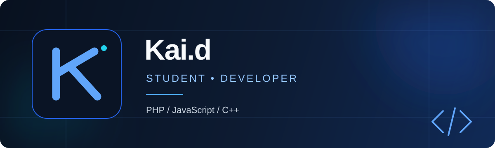

<p align="center">
  
</p>

<p align="center">
  <a href="https://github.com/nabilg1?tab=followers"></a>
  
</p>

## About

I'm **Kai.d**, a student building a strong foundation in software development. I enjoy learning how software works, solving programming problems, and turning small ideas into useful projects.

```javascript
const kai = {
  role: "Student",
  focus: "Software Development",
  languages: ["PHP", "JavaScript", "C++"],
  currentlyLearning: "Building better projects, one step at a time"
};
```

## Tools & technologies

<p align="left">
  
</p>

## Current focus

- Strengthening programming fundamentals
- Practicing problem-solving with C++
- Learning web development with PHP and JavaScript
- Preparing my first public projects

## GitHub overview

<p align="center">
  
  
</p>

<p align="center">
  
</p>

---

<p align="center"><sub>Learning consistently, one commit at a time.</sub></p>
